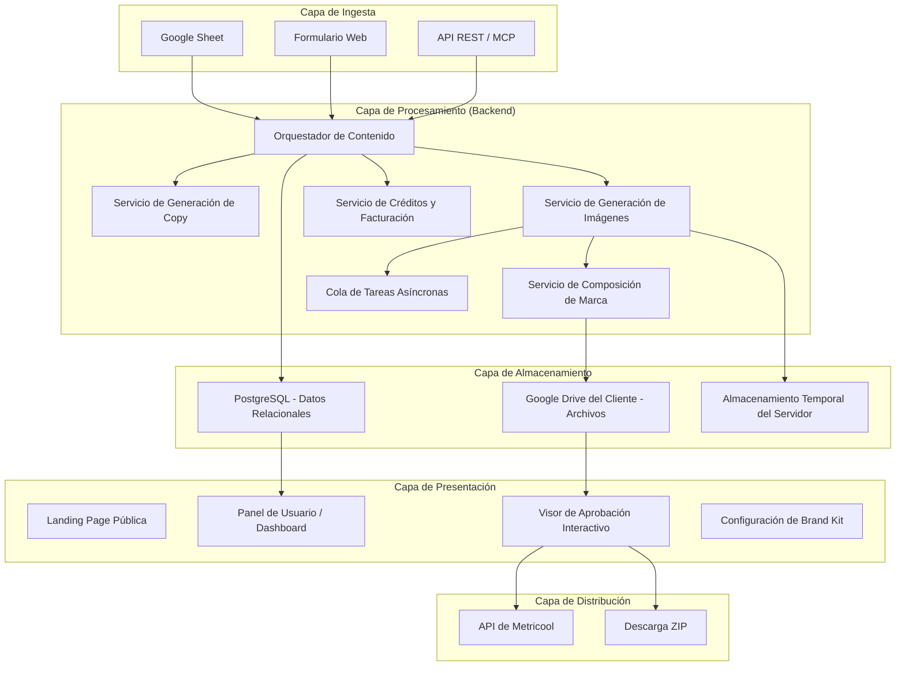
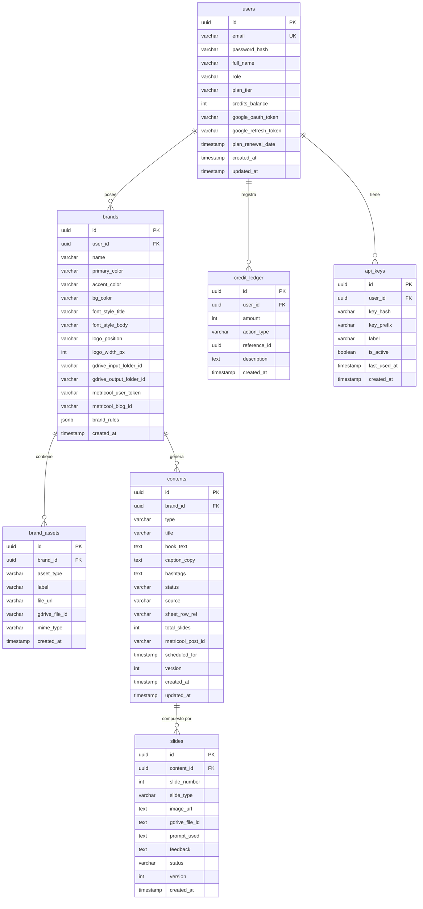

# TECNOGEN STUDIO — Especificación Técnica y de Producto Completa (PRD)

> **Versión:** 1.0  
> **Fecha:** 2026-09-23  
> **Empresa:** TecnoGen (tecnogen.ar)  
> **Producto:** TecnoGen Studio (studio.tecnogen.ar)  
> **Tipo:** SaaS B2B — Plataforma de generación de contenido visual con IA  
> **Responsable:** Marcelo Mujica

---

## 1. VISIÓN DEL PRODUCTO

### 1.1 Definición
TecnoGen Studio es una plataforma SaaS multi-tenant que permite a dueños de negocio, creadores de contenido y agencias de marketing transformar ideas o guiones estructurados en piezas visuales de alto impacto (Carruseles, Posts individuales y, en fases futuras, Reels/Videos) utilizando modelos de generación de imágenes con IA, respetando la identidad visual de cada marca.

### 1.2 Propuesta de Valor
- **Para el dueño de negocio:** Generar contenido profesional para redes sociales sin necesidad de un diseñador gráfico, en minutos, respetando su identidad de marca.
- **Para agencias:** Escalar la producción de contenido para múltiples clientes con un sistema centralizado de aprobación y publicación.
- **Para creadores:** Conectar sus herramientas de IA favoritas (ChatGPT, Claude, etc.) vía API/MCP y obtener piezas visuales listas para publicar.

### 1.3 Diferenciadores Clave
1. **Zero-Storage para el operador:** Los archivos del cliente viven en su Google Drive; TecnoGen Studio no almacena archivos permanentes.
2. **Corrección granular por slide:** Si un carrusel de 7 slides tiene 6 perfectos y 1 con error, solo se regenera ese slide (1 crédito), no el carrusel entero.
3. **API/MCP abierto:** Los clientes pueden disparar generaciones desde cualquier agente de IA externo.
4. **Integración directa con Metricool:** Obtención de mejores horarios de publicación y programación en 1 clic.

---

## 2. PÚBLICO OBJETIVO Y CASOS DE USO

### 2.1 Segmentos de Cliente

| Segmento | Perfil | Necesidad Principal | Plan Típico |
|:---|:---|:---|:---|
| **Dueño de Negocio Individual** | Clínica dental, restaurante, tienda, profesional independiente | Generar 8-10 carruseles/mes con su marca sin contratar diseñador | Starter |
| **Negocio en Crecimiento** | Franquicia, clínica con múltiples profesionales, e-commerce mediano | Producción constante de contenido para 1-3 marcas/sucursales | Growth |
| **Agencia de Marketing** | Gestiona 5-20 clientes, community managers | Producción masiva multi-marca con control centralizado y API | Agency |

### 2.2 Casos de Uso Primarios

**Caso 1: Generación desde Google Sheet**
1. El cliente tiene un Google Sheet con columnas: `#`, `Tema`, `Doctora/Sujeto`, `Notas`.
2. Conecta la URL del Sheet en TecnoGen Studio.
3. El sistema lee las filas con estado `Pendiente`, genera el copy estructurado (hooks, cuerpo por slide, CTA).
4. El cliente revisa el copy en el panel y aprueba las ideas que le gustan.
5. Al aprobar, el sistema genera las imágenes con IA y las deposita en el visor de aprobación.
6. El cliente revisa, aprueba o solicita correcciones puntuales por slide.
7. Al aprobar el carrusel completo, programa en Metricool.

**Caso 2: Generación desde Formulario Rápido**
1. El cliente escribe un tema en el formulario web (ej: "5 señales de que tu diente necesita conducto").
2. El sistema estructura automáticamente los slides, genera las imágenes y las presenta en el visor.

**Caso 3: Generación vía API/MCP desde un agente externo**
1. El cliente configura su API Key de TecnoGen Studio en su Claude Desktop / ChatGPT / Make / Zapier.
2. Le dice a su IA: "Creame un carrusel sobre limpieza dental para la Dra. Jessica".
3. La IA envía un JSON estructurado al endpoint de TecnoGen Studio.
4. El carrusel aparece generado en el visor web del cliente, listo para aprobación.

---

## 3. ARQUITECTURA DE ALTO NIVEL

### 3.1 Diagrama de Arquitectura



### 3.2 Stack Tecnológico — Decisiones Tomadas

| Capa | Tecnología | Justificación |
|:---|:---|:---|
| **Backend** | **Python 3.11+ con FastAPI** + Uvicorn | Ecosistema nativo de OpenAI SDK, Pillow, Google API Client. Async nativo con `asyncio`. |
| **Base de Datos** | **PostgreSQL 16** (Producción) / SQLite WAL (Desarrollo local) | Transacciones ACID para control de créditos. SQLAlchemy 2.0 + Alembic para migraciones. |
| **Cola de Tareas** | **Celery + Redis** (Producción) / `BackgroundTasks` de FastAPI (MVP) | La generación de imágenes tarda 15-30 segundos por slide; debe ser asíncrona. |
| **Frontend** | **Vite + React 18 + Tailwind CSS + Shadcn UI + Lucide Icons** | Compila a HTML/JS estático en 2 segundos. Sin servidor Node en producción. Sin problemas de hydration, SSR ni compilación lenta de Next.js. El mismo FastAPI sirve los estáticos. |
| **Motor de Imagen** | **OpenAI Image API** con modelo `gpt-image-2.5-sunburst` | Genera imágenes con texto embebido de alta fidelidad. El texto forma parte de la imagen. |
| **Composición de Marca** | **Pillow (PIL)** | Superposición determinista del logo oficial (PNG transparente, canal alfa) sobre la imagen generada por IA. Coordenadas y tamaño configurables por marca. |
| **Autenticación** | **JWT (JSON Web Tokens)** con refresh tokens | Stateless, escalable. Google OAuth 2.0 como opción adicional (necesario para vincular Drive). |
| **Pagos** | **Stripe** (Internacional) / **MercadoPago** (LATAM) / **LemonSqueezy** (alternativa simple) | Suscripciones recurrentes + compra de packs de créditos adicionales. |
| **Almacenamiento de Archivos** | **Google Drive del cliente** (vía Google Drive API v3) | Cero costo de almacenamiento para el operador. Cada cliente usa su propia cuota de Drive (15 GB gratis). |
| **Despliegue** | **VPS Linux** con Docker Compose (FastAPI + PostgreSQL + Redis + Nginx) | Control total. Sin dependencia de Vercel ni plataformas serverless. |

---

## 4. MODELO DE DATOS COMPLETO

### 4.1 Diagrama Entidad-Relación



### 4.2 Esquema SQL Completo (DDL)

```sql
-- ============================================================
-- TECNOGEN STUDIO — ESQUEMA DE BASE DE DATOS COMPLETO
-- Motor: PostgreSQL 16+
-- ============================================================

-- 1. USUARIOS
CREATE TABLE users (
    id UUID PRIMARY KEY DEFAULT gen_random_uuid(),
    email VARCHAR(255) UNIQUE NOT NULL,
    password_hash VARCHAR(255) NOT NULL,
    full_name VARCHAR(100),
    role VARCHAR(20) NOT NULL DEFAULT 'client',
        -- Valores: 'admin', 'client', 'agency'
    plan_tier VARCHAR(20) NOT NULL DEFAULT 'starter',
        -- Valores: 'starter' (75 créditos), 'growth' (220 créditos), 'agency' (750 créditos)
    credits_balance INT NOT NULL DEFAULT 75
        CHECK (credits_balance >= 0),
    google_oauth_token TEXT,
    google_refresh_token TEXT,
    stripe_customer_id VARCHAR(100),
    plan_renewal_date TIMESTAMP WITH TIME ZONE,
    created_at TIMESTAMP WITH TIME ZONE NOT NULL DEFAULT NOW(),
    updated_at TIMESTAMP WITH TIME ZONE NOT NULL DEFAULT NOW()
);

CREATE INDEX idx_users_email ON users(email);

-- 2. HISTORIAL DE CRÉDITOS (Ledger de Auditoría Inmutable)
CREATE TABLE credit_ledger (
    id UUID PRIMARY KEY DEFAULT gen_random_uuid(),
    user_id UUID NOT NULL REFERENCES users(id) ON DELETE CASCADE,
    amount INT NOT NULL,
    action_type VARCHAR(50) NOT NULL,
    reference_id UUID,
    description TEXT,
    created_at TIMESTAMP WITH TIME ZONE NOT NULL DEFAULT NOW()
);

CREATE INDEX idx_credit_ledger_user ON credit_ledger(user_id);
CREATE INDEX idx_credit_ledger_created ON credit_ledger(created_at);

-- 3. MARCAS (Brand Kit Multi-Tenant)
CREATE TABLE brands (
    id UUID PRIMARY KEY DEFAULT gen_random_uuid(),
    user_id UUID NOT NULL REFERENCES users(id) ON DELETE CASCADE,
    name VARCHAR(100) NOT NULL,
    primary_color VARCHAR(7) NOT NULL DEFAULT '#16345F',
    accent_color VARCHAR(7) NOT NULL DEFAULT '#7DD3FC',
    bg_color VARCHAR(7) DEFAULT '#0B1E38',
    font_style_title VARCHAR(50) DEFAULT 'serif-editorial',
    font_style_body VARCHAR(50) DEFAULT 'sans-modern',
    logo_position VARCHAR(30) DEFAULT 'top-left',
    logo_width_px INT DEFAULT 180
        CHECK (logo_width_px BETWEEN 80 AND 400),
    gdrive_input_folder_id TEXT,
    gdrive_output_folder_id TEXT,
    sheets_url TEXT,
    metricool_user_token TEXT,
    metricool_blog_id VARCHAR(100),
    brand_rules JSONB DEFAULT '{}'::jsonb,
    created_at TIMESTAMP WITH TIME ZONE NOT NULL DEFAULT NOW()
);

CREATE INDEX idx_brands_user ON brands(user_id);

-- 4. ASSETS DE MARCA (Logos, Fotos de Equipo/Productos)
CREATE TABLE brand_assets (
    id UUID PRIMARY KEY DEFAULT gen_random_uuid(),
    brand_id UUID NOT NULL REFERENCES brands(id) ON DELETE CASCADE,
    asset_type VARCHAR(30) NOT NULL,
    label VARCHAR(100),
    file_url TEXT,
    gdrive_file_id TEXT,
    mime_type VARCHAR(50),
    created_at TIMESTAMP WITH TIME ZONE NOT NULL DEFAULT NOW()
);

CREATE INDEX idx_brand_assets_brand ON brand_assets(brand_id);

-- 5. CONTENIDOS (Carruseles, Posts, Videos)
CREATE TABLE contents (
    id UUID PRIMARY KEY DEFAULT gen_random_uuid(),
    brand_id UUID NOT NULL REFERENCES brands(id) ON DELETE CASCADE,
    type VARCHAR(20) NOT NULL DEFAULT 'carousel',
    title VARCHAR(255) NOT NULL,
    hook_text TEXT,
    caption_copy TEXT,
    hashtags TEXT,
    status VARCHAR(30) NOT NULL DEFAULT 'draft',
    source VARCHAR(30) DEFAULT 'web_form',
    sheet_row_ref VARCHAR(50),
    total_slides INT DEFAULT 6
        CHECK (total_slides BETWEEN 1 AND 15),
    metricool_post_id VARCHAR(100),
    scheduled_for TIMESTAMP WITH TIME ZONE,
    version INT NOT NULL DEFAULT 1,
    created_at TIMESTAMP WITH TIME ZONE NOT NULL DEFAULT NOW(),
    updated_at TIMESTAMP WITH TIME ZONE NOT NULL DEFAULT NOW()
);

CREATE INDEX idx_contents_brand ON contents(brand_id);
CREATE INDEX idx_contents_status ON contents(status);

-- 6. SLIDES INDIVIDUALES
CREATE TABLE slides (
    id UUID PRIMARY KEY DEFAULT gen_random_uuid(),
    content_id UUID NOT NULL REFERENCES contents(id) ON DELETE CASCADE,
    slide_number INT NOT NULL
        CHECK (slide_number >= 1),
    slide_type VARCHAR(30) DEFAULT 'content',
    image_url TEXT NOT NULL,
    gdrive_file_id TEXT,
    prompt_used TEXT NOT NULL,
    feedback TEXT,
    status VARCHAR(20) NOT NULL DEFAULT 'pending',
    version INT NOT NULL DEFAULT 1,
    created_at TIMESTAMP WITH TIME ZONE NOT NULL DEFAULT NOW(),
    UNIQUE(content_id, slide_number, version)
);

CREATE INDEX idx_slides_content ON slides(content_id);

-- 7. API KEYS PARA CLIENTES
CREATE TABLE api_keys (
    id UUID PRIMARY KEY DEFAULT gen_random_uuid(),
    user_id UUID NOT NULL REFERENCES users(id) ON DELETE CASCADE,
    key_hash VARCHAR(64) NOT NULL,
    key_prefix VARCHAR(12) NOT NULL,
    label VARCHAR(100),
    is_active BOOLEAN NOT NULL DEFAULT true,
    last_used_at TIMESTAMP WITH TIME ZONE,
    created_at TIMESTAMP WITH TIME ZONE NOT NULL DEFAULT NOW()
);

CREATE INDEX idx_api_keys_user ON api_keys(user_id);
CREATE INDEX idx_api_keys_hash ON api_keys(key_hash);
```

---

## 5. ESPECIFICACIÓN DETALLADA DE LA API REST

### 5.1 Autenticación
`Authorization: Bearer <jwt_token>`  
`X-KS-API-Key: tg_live_xxxxxxxxxxxxxxxxxx`

### 5.2 Endpoints Clave
- `POST /api/v1/auth/register`
- `POST /api/v1/auth/login`
- `POST /api/v1/auth/google`
- `GET /api/v1/user/profile`
- `GET /api/v1/brands`
- `POST /api/v1/brands`
- `POST /api/v1/brands/{brand_id}/assets`
- `POST /api/v1/brands/{brand_id}/connect-drive`
- `POST /api/v1/brands/{brand_id}/connect-sheets`
- `POST /api/v1/brands/{brand_id}/connect-metricool`
- `POST /api/v1/contents/generate` (202 Accepted + Descuento Atómico)
- `GET /api/v1/contents`
- `GET /api/v1/contents/{content_id}`
- `POST /api/v1/contents/{content_id}/slides/{slide_number}/regenerate` (1 crédito)
- `POST /api/v1/contents/{content_id}/approve`
- `GET /api/v1/contents/{content_id}/download` (ZIP)
- `GET /api/v1/integrations/metricool/best-times`
- `POST /api/v1/integrations/metricool/schedule`
- `POST /api/v1/public/generate` (MCP / API externa)
- `GET /api/v1/billing/balance`
- `POST /api/v1/billing/purchase-pack`

---

## 6. SERVICIO DE GENERACIÓN DE IMÁGENES & COMPOSER

### 6.1 Modelo de Imagen
- **Modelo:** `gpt-image-2.5-sunburst` (OpenAI Image API)
- **Formato:** `1024x1536` px (2:3 vertical), calidad `high`, salida PNG base64.
- **Zona Superior Izquierda:** Reservada para superposición del logo oficial.

### 6.2 Composición con Pillow (RGBA)
Superposición de logo PNG con canal alfa, redimensionado con Lanczos y posicionamiento exacto según configuración de marca (`top-left`, `top-right`, etc.).

---

## 7. ESPECIFICACIÓN DE FRONTEND

- **Vite + React 18 + Tailwind CSS + Lucide Icons**
- **Landing Page (`/`):** Visor demo interactivo y tabla de precios.
- **Dashboard (`/app/dashboard`):** Contador de créditos, actividad y estados.
- **Visor de Aprobación (`/app/viewer/{content_id}`):** Viewport nativo 1024x1536, navegación fluida, regeneración por slide (1 crédito), descarga ZIP y programación en Metricool.
- **Brand Kit (`/app/brands`):** Paleta de colores, logos, biblioteca de fotos y reglas de composición.

---

## 8. MODELO COMERCIAL & PRECIOS

| Plan | Precio | Créditos Mensuales | Marcas | Funcionalidades |
|:---|:---|:---|:---|:---|
| **Starter** | \$29/mes | 75 créditos | 1 | Google Drive, descargas |
| **Growth** | \$69/mes | 220 créditos | 3 | + Metricool, soporte prioritario |
| **Agency** | \$149/mes | 750 créditos | Ilimitadas | + API/MCP, multi-usuario |

- **Crédito:** 1 crédito = 1 slide generado o regenerado.
- **Costo operativo directo:** ~\$0.25 - \$0.50 USD por carrusel de 6 slides.
- **Margen bruto:** ~78% - 83%.

---

## 9. ESTRATEGIA ZERO-STORAGE

1. **Lectura (Input):** Google Drive del cliente (`/Fotos/`) -> Descarga temporal.
2. **Generación:** OpenAI API -> Pillow compone logo en memoria.
3. **Escritura (Output):** Subida directa al Google Drive del cliente (`/Carruseles_Generados/`).
4. **Limpieza:** Purga inmediata de temporales en servidor (\$0 costo de storage permanente).
