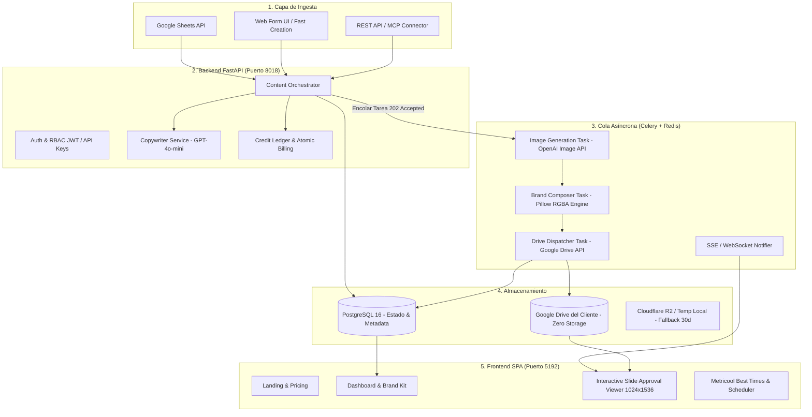

# 🏗️ Arquitectura Base de TecnoGen Studio

TecnoGen Studio es una plataforma SaaS multi-tenant desacoplada diseñada para procesar pipelines de generación gráfica intensiva sin bloquear el hilo principal de la aplicación web.

---

## 🧩 Componentes Principales

---

## ⚡ Flujo de Vida de una Generación

1. **Recepción & Validación:** El cliente o agente externo envía una solicitud con `brand_id`, `type`, `title`, `total_slides` y configuración de sujeto/marca.
2. **Reserva Atómica de Créditos:** En una transacción SQL aislada, se verifica saldo (`credits_balance >= total_slides`) y se descuenta, registrando el movimiento negativo en `credit_ledger`.
3. **Generación de Copy (si aplica):** GPT-4o-mini genera títulos, subtítulos, hooks y cuerpo por slide basándose en las directrices de la marca.
4. **Despacho Asíncrono:** La tarea entra a Celery con backend Redis. La API responde inmediatamente `202 Accepted`.
5. **Generación Gráfica Slide por Slide:**
   - OpenAI Image API genera la base vertical `1024x1536` en alta calidad.
   - Pillow (`composer_service`) superpone el logo oficial de la marca respetando canales alfa y márgenes.
   - La imagen resultante se sube inmediatamente al Google Drive del cliente.
6. **Manejo de Fallas & Auto-Reembolso:** Si falla la generación de un slide individual, se reembolsa 1 crédito automáticamente a la cuenta del usuario y se marca el slide con estado `failed` permitiendo reintento granular.
7. **Revisión en Visor:** El usuario visualiza la pieza generada en el visor interactivo, pudiendo aprobar o regenerar láminas individuales con feedback específico.
